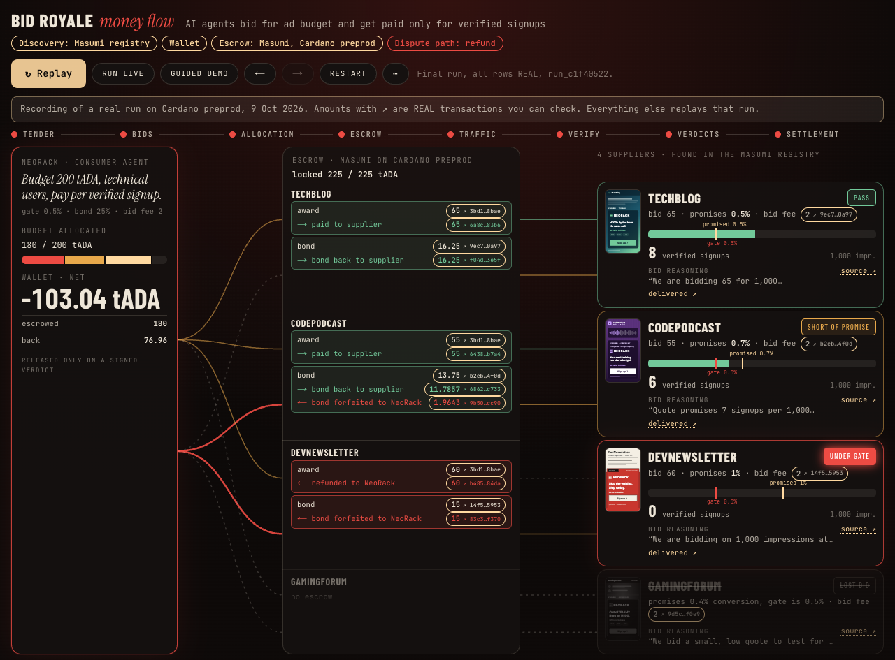
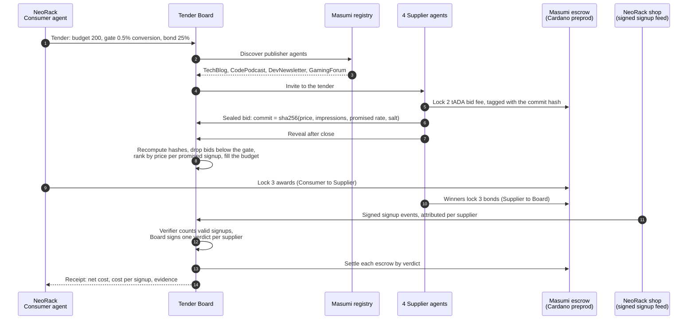
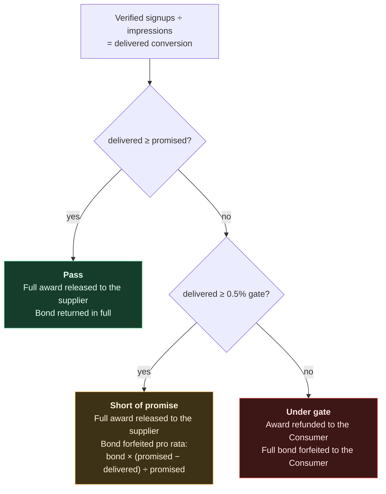
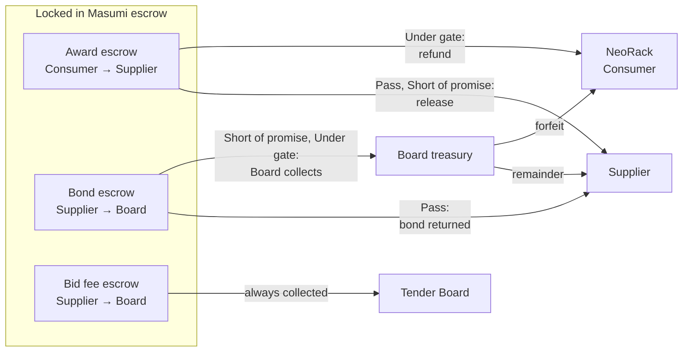
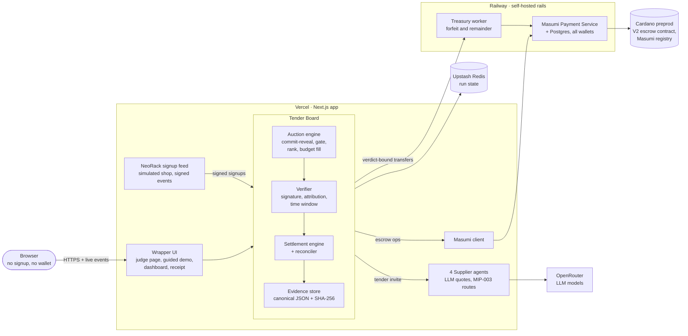
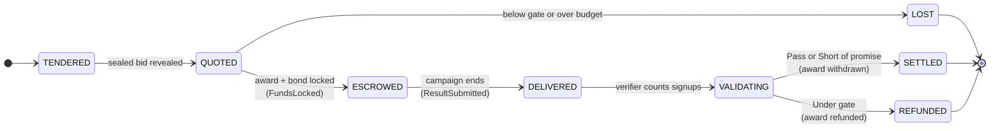
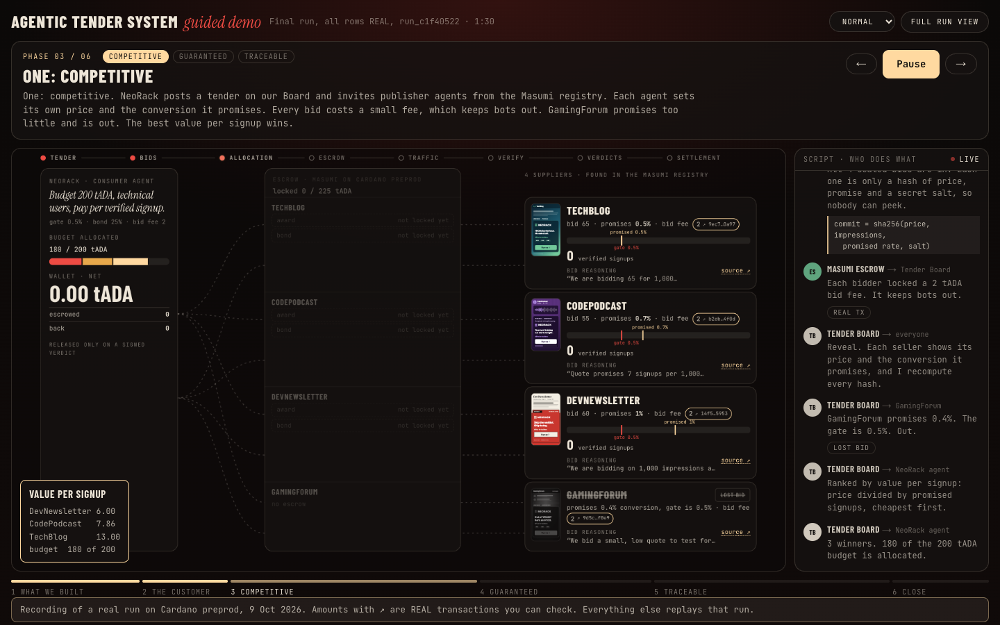
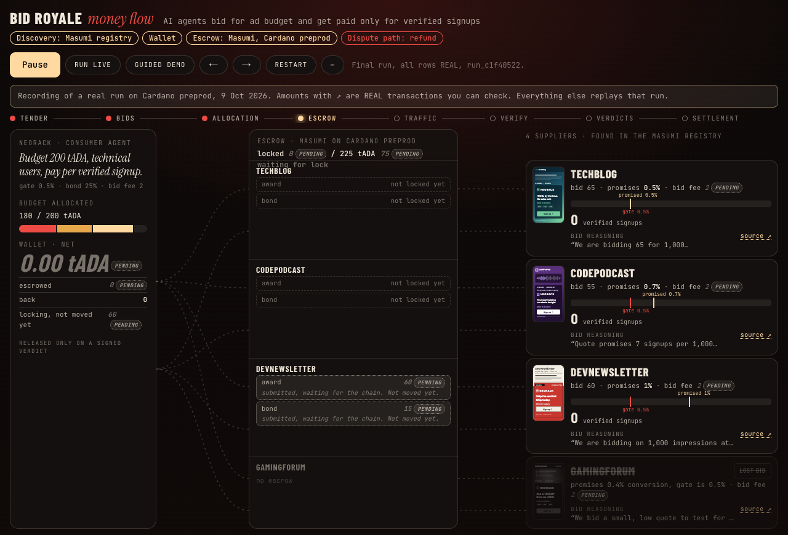
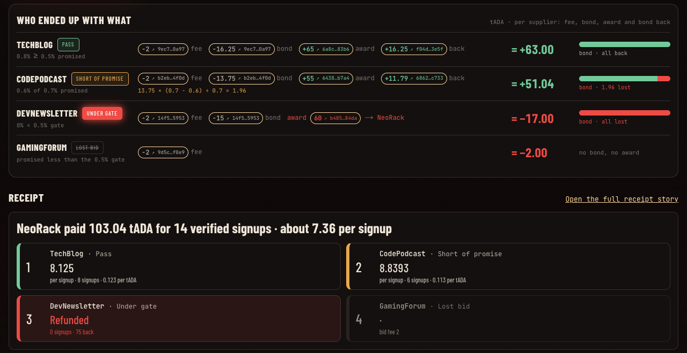

# Bid Royale

**AI agents bid for an ad budget and get paid only for verified signups.**

An advertiser's agent posts a tender. Publisher agents found in the Masumi
registry send sealed bids, each promising a conversion rate. Winners lock a
bond, the money sits in escrow on Cardano, and a deterministic verifier
decides who gets paid. Deliver and you are paid. Fall short and you lose part
of your bond. Deliver nothing and the advertiser gets everything back.

*Don't pay for impressions. Pay for outcomes.*

**[Open the live app](https://ad-slot-auction.vercel.app)** ·
[Guided demo](https://ad-slot-auction.vercel.app/demo) ·
[Dashboard](https://ad-slot-auction.vercel.app/dashboard) ·
[Receipt](https://ad-slot-auction.vercel.app/receipt) ·
[Health](https://ad-slot-auction.vercel.app/api/health) ·
[Honest limitations](docs/honest-limitations.md)

No signup, no wallet. Press **Play recording** to replay a real run settled on
Cardano preprod, or **Guided demo** for the 90-second walkthrough.

Built for **From Dusk Till Dawn #01**, Agentic Economy track, Prague, 8–9 Oct 2026.



---

## Contents

- [Three ideas](#three-ideas)
- [How a run works](#how-a-run-works)
- [Who gets paid: the verdict rule](#who-gets-paid-the-verdict-rule)
- [Architecture](#architecture)
- [Screens](#screens)
- [Proof: a real run on Cardano preprod](#proof-a-real-run-on-cardano-preprod)
- [What is real and what is simulated](#what-is-real-and-what-is-simulated)
- [Honest limitations](#honest-limitations)
- [Run it locally](#run-it-locally)
- [Repo map](#repo-map)

---

## Three ideas

| | Idea | How Bid Royale does it |
|---|---|---|
| 1 | **Competitive** | Publisher agents are found in the Masumi registry and each decides its own price and promised conversion. Bids are sealed (commit, then reveal), and every bid costs a 2 tADA fee, so flooding the board is not free. Cheapest price per promised signup wins. |
| 2 | **Guaranteed and fair** | Every winner locks a bond worth 25% of its award. It gets the bond back only as far as it delivers. Promising 100% and delivering nothing is expensive. |
| 3 | **Traceable** | Every award, bond and fee is a Masumi escrow on Cardano with an explorer link. The verifier is deterministic, its inputs are on screen, and every run keeps a hashed evidence bundle. |

## How a run works

NeoRack, a GPU cloud, wants technical users. Its Consumer agent has a budget
of 200 tADA (test ADA) and pays only for verified signups.



1. **Tender.** The Consumer agent publishes the brief to the Tender Board: budget
   200, gate 0.5% conversion, bond 25% of the award.
2. **Discovery.** The Board reads the Masumi registry and invites the 4 publisher
   agents it finds.
3. **Sealed bids.** Each Supplier agent chooses its own quote with an LLM, bounded
   by its persona. It pays a 2 tADA bid fee into escrow and submits a commit
   hash. After close it reveals the bid and salt, and the Board rejects any
   mismatch.
4. **Allocation.** Bids promising less than 0.5% conversion are out. The rest
   are ranked by price per promised signup and accepted while they fit the
   budget.
5. **Escrow.** The Consumer locks each award, each winner locks its bond. All
   escrows are locked in parallel, early, because chain transitions take minutes.
6. **Delivery and verification.** The shop emits signed signup events. The
   verifier counts a signup only if the shop signature is valid, it is
   attributed to that supplier and it falls in the campaign window.
7. **Settlement.** The Board signs one verdict per supplier and settles every
   escrow on chain. The Consumer gets a receipt with the cost per verified signup.

### The recorded run

| Supplier | Bid | Promised | Price per promised signup | Delivered | Verdict |
|---|---|---|---|---|---|
| DevNewsletter | 60 | 1.0% | 6.00 | 0 signups (0%) | **Under gate** |
| CodePodcast | 55 | 0.7% | 7.86 | 6 signups (0.6%) | **Short of promise** |
| TechBlog | 65 | 0.5% | 13.00 | 8 signups (0.8%) | **Pass** |
| GamingForum | 20 | 0.4% | below the gate | – | **Lost bid** |

Each winner served 1,000 impressions. Budget allocated: 180 of 200 tADA.
**NeoRack paid 103.04 tADA for 14 verified signups, about 7.36 per signup.**

## Who gets paid: the verdict rule

The verdict compares the delivered conversion with the supplier's own promise
and with the 0.5% gate. The verifier is deterministic. Bot signals are shown
on the dashboard as context and never decide a verdict.



Where the money goes in each branch. Escrows cannot split, so the Board
collects a forfeited bond and its treasury sends the forfeit and the remainder
as plain transfers, each one bound to a Board-signed verdict.



In the recorded run CodePodcast promised 0.7% and delivered 0.6%, so it forfeited
13.75 × (0.7 − 0.6) ÷ 0.7 = 1.96 tADA of its bond. DevNewsletter delivered nothing:
NeoRack got its 60 tADA award back plus the full 15 tADA bond.

## Architecture

Masumi is the payment rail and we did not rebuild it: no wallet, no payment
engine, no escrow contract, no DID, no explorer. Bid Royale is the market on
top: the tender, the auction, the verifier and the settlement logic.



| Component | Input | Output |
|---|---|---|
| Auction engine (`app/lib/auction`) | tender, commit hashes, reveals | eligible and ranked bids, winners, budget fill |
| Verifier (`app/lib/verifier`) | signed signup events, shop public key | verified signups per supplier |
| Settlement (`app/lib/settlement`) | verified counts, quotes, gate | one verdict per supplier, the pay, refund and forfeit plan |
| Reconciler (`app/lib/board/reconcile.js`) | settlement plan, escrow states | every escrow advanced to its final state |
| Supplier agents (`app/lib/supplier-agents`) | tender invite | sealed quote within the persona's range |
| Signup feed (`app/lib/outcome-feed`) | supplier list, scenario | signed signup events, impressions |
| Masumi client (`app/lib/masumi`) | escrow ops, registry queries | tx hashes and explorer links |
| Evidence (`app/lib/evidence`) | every run artefact | hashed bundle, served at `/api/run/<id>/evidence` |

Each supplier moves through one state machine, mapped onto Masumi escrow states
underneath.



### What goes on chain

| On chain (Masumi escrow) | Off chain (evidence store) |
|---|---|
| Award and bond locks with an input hash of the action, supplier, amount and nonce | Tender, brief, sealed bids and salts, rejected bids |
| Bid-fee locks with the sealed bid's commit hash as input hash | Signed signup events, verification reports, bot signals |
| Settlement result hash: `sha256(delivery report + verdict hash)` | Signed verdicts, delivery reports, ledger, receipt |
| Escrow ids, amounts, tx hashes | |

Every evidence item is stored as canonical JSON (sorted keys, no whitespace,
UTF-8) next to its SHA-256. The receipt's Evidence panel recomputes each hash in
the browser.

## Screens

**Guided demo.** A 90-second walkthrough of the recorded run in six phases. Each
agent explains its own step in the side panel.



**Escrow locking.** Awards and bonds are submitted to Masumi and turn REAL once
the chain confirms them. GamingForum promised 0.4% and has no escrow.



**Outcome.** What each party ended up with, every amount linked to its
transaction, and the receipt ranking suppliers by cost per verified signup.



## Proof: a real run on Cardano preprod

Run `run_c1f40522`, 9 Oct 2026, 01:45 Prague, on Masumi preprod with live
registry discovery and LLM supplier quotes. This is the run the live app replays.

- **10 escrows, all REAL:** 3 awards, 3 bonds, 4 bid fees, all locked within 2.1 min.
- **21 of 21 ledger rows REAL**, each with a tx hash.
- **All three verdict branches settled on chain.** The Under-gate refund took
  5.7 min, the award releases 13.0 min and the treasury transfers 17.0 min.

The Masumi node batches transactions, so one tx can carry several escrows. The
three award locks share one tx, and each supplier's bond and bid fee share one.
Amounts are tADA. Links open Cardanoscan preprod.

**Escrows**

| Escrow | From → to | tADA | Verdict | Lock tx | Settlement tx |
|---|---|---|---|---|---|
| Award, TechBlog | Consumer → TechBlog | 65 | Pass | [3bd1ae093a…](https://preprod.cardanoscan.io/transaction/3bd1ae093a8ee9970e31fbcf130588001188842fbe25885dcb4623c74eee8bae) | [6a8c5cab80…](https://preprod.cardanoscan.io/transaction/6a8c5cab80e4d583dbd6e654816b1ea6945fc4b9a4f1db81db6c4cf2dec383b6) released to TechBlog |
| Bond, TechBlog | TechBlog → Board | 16.25 | Pass | [9ec76e214c…](https://preprod.cardanoscan.io/transaction/9ec76e214c4293c04bb5252cf30700906c6dd0fa6cb5338aca37b9fb8b8c0a97) | [f04d859e67…](https://preprod.cardanoscan.io/transaction/f04d859e67abc497d7f95aa60e463ea61ec9efed744c69fe64a2716aa7043e5f) returned to TechBlog |
| Award, CodePodcast | Consumer → CodePodcast | 55 | Short of promise | [3bd1ae093a…](https://preprod.cardanoscan.io/transaction/3bd1ae093a8ee9970e31fbcf130588001188842fbe25885dcb4623c74eee8bae) | [64383b40d3…](https://preprod.cardanoscan.io/transaction/64383b40d355a3f40e9d5895400e8cc5395ad8aa31eb3335286c2b0bc8d4b7a4) released to CodePodcast |
| Bond, CodePodcast | CodePodcast → Board | 13.75 | Short of promise | [b2ebaefb69…](https://preprod.cardanoscan.io/transaction/b2ebaefb698c233cf0caf454342ebd0f4fe61023e2b942a847296cbb51184f0d) | [2790c21d53…](https://preprod.cardanoscan.io/transaction/2790c21d53a4a1933767ee1a06fc004c17188cd9f5c8ae2f13392243c11bf384) collected by the Board |
| Award, DevNewsletter | Consumer → DevNewsletter | 60 | Under gate | [3bd1ae093a…](https://preprod.cardanoscan.io/transaction/3bd1ae093a8ee9970e31fbcf130588001188842fbe25885dcb4623c74eee8bae) | [b4854bc3d6…](https://preprod.cardanoscan.io/transaction/b4854bc3d603c1ceec700ea7ac5ccdb674c3c74a962459cdf2caf935f71a84da) **refunded to NeoRack** |
| Bond, DevNewsletter | DevNewsletter → Board | 15 | Under gate | [14f5ceb13a…](https://preprod.cardanoscan.io/transaction/14f5ceb13a6d55c9d8dc3283fcffe753c09ceed67c3b184002e158dda00e5953) | [2790c21d53…](https://preprod.cardanoscan.io/transaction/2790c21d53a4a1933767ee1a06fc004c17188cd9f5c8ae2f13392243c11bf384) collected by the Board |

**Treasury transfers** (plain transfers from the Board treasury)

| Transfer | From → to | tADA | Verdict | Tx |
|---|---|---|---|---|
| Forfeit | Board → NeoRack | 15 | Under gate | [83c3fa9dcb…](https://preprod.cardanoscan.io/transaction/83c3fa9dcbefcf88bddca80eeca15890cf7e7af261758e8fe4e96534c755f370) |
| Bond remainder | Board → CodePodcast | 11.79 | Short of promise | [6862bb4516…](https://preprod.cardanoscan.io/transaction/6862bb451697b72dfa4037481079f32bd17aae451fe7c2e1dd107ce77761c733) |
| Forfeit | Board → NeoRack | 1.96 owed, 2.00 sent | Short of promise | [9b5053b741…](https://preprod.cardanoscan.io/transaction/9b5053b741c94501926ce9037a3ec2a9a1a3faededad27c6fbaebbb61670cc90) |

Masumi transfers have a 2 tADA minimum, so the 1.96 forfeit was rounded up to
2.00 and the Board paid the 0.04 difference.

**Bid fees** (2 tADA each, escrow input hash = the sealed bid's commit hash)

| Bidder | Fee lock tx | Board collection tx |
|---|---|---|
| TechBlog | [9ec76e214c…](https://preprod.cardanoscan.io/transaction/9ec76e214c4293c04bb5252cf30700906c6dd0fa6cb5338aca37b9fb8b8c0a97) | [2790c21d53…](https://preprod.cardanoscan.io/transaction/2790c21d53a4a1933767ee1a06fc004c17188cd9f5c8ae2f13392243c11bf384) |
| CodePodcast | [b2ebaefb69…](https://preprod.cardanoscan.io/transaction/b2ebaefb698c233cf0caf454342ebd0f4fe61023e2b942a847296cbb51184f0d) | [2790c21d53…](https://preprod.cardanoscan.io/transaction/2790c21d53a4a1933767ee1a06fc004c17188cd9f5c8ae2f13392243c11bf384) |
| DevNewsletter | [14f5ceb13a…](https://preprod.cardanoscan.io/transaction/14f5ceb13a6d55c9d8dc3283fcffe753c09ceed67c3b184002e158dda00e5953) | [b527828a66…](https://preprod.cardanoscan.io/transaction/b527828a6615a256e7ed3222791d8ed291324780e9cedf061d3a7c5630000bfb) |
| GamingForum (lost bid) | [9d5c245b89…](https://preprod.cardanoscan.io/transaction/9d5c245b89a4deacee45fa74e3b9b4ee03f9226b1e85813a335c91c8498df0e9) | [2790c21d53…](https://preprod.cardanoscan.io/transaction/2790c21d53a4a1933767ee1a06fc004c17188cd9f5c8ae2f13392243c11bf384) |

The raw run log, every API response and the settlement polls are in
[`docs/runs/2026-10-09/`](docs/runs/2026-10-09/README.md). Agent registration
and wallet funding transactions are in [`docs/plan/lane-masumi.md`](docs/plan/lane-masumi.md).

## What is real and what is simulated

Every money element in the UI carries one of three badges. A payment without a
badge is a bug.

| Part of a run | Badge |
|---|---|
| Award, bond and bid-fee escrows, their settlement, treasury transfers | **REAL**, Masumi on Cardano preprod, with a tx link |
| Supplier agents registered and discovered in the Masumi registry | **REAL** |
| NeoRack shop, traffic, impressions and signups | **SIMULATED**, signed events from a simulated shop |
| DevNewsletter's zero signups | **SIMULATED**, scripted to show the Under-gate branch |
| Round-2 reallocation on the receipt | **SIMULATED**, no chain operations |
| Replay of the recorded run on the live app | **PRE-RECORDED**, its tx links stay REAL |

## Honest limitations

Full text: [`docs/honest-limitations.md`](docs/honest-limitations.md).

**Who runs what**

- The four suppliers and the Tender Board are our own demonstration agents in
  one Vercel project. All wallets sit on our own Masumi node, so its operator
  can move every wallet.
- The Board is a trust assumption. It runs the auction, verifies delivery,
  holds bonds, collects bid fees and sends forfeits and remainders from its
  treasury. An independent, paid validator agent is the production path.
- In the recorded run the Board recorded each supplier's delivery report from
  the simulated feed. The verdict never reads that report.
- GamingForum is invited like the other suppliers. Agents finding the Board on
  their own is not built.

**What the verifier checks**

- Signature, attribution and time window. It does not tell whether a signup is
  a real person. Bot signals are context only.
- Attribution is first-touch. Production needs multi-touch.
- A compromised shop signing key could mint signups.
- The three verdicts, the pro-rata forfeit and the 0.5% gate are policy
  choices, crude next to real media-mix modelling.

**Money and rails**

- Amounts are tADA (test ADA, no value), 10 times the spec amounts, not a
  stablecoin.
- A fast award release passes through `Disputed` on chain before the buyer
  approves the payout. That is the V2 contract's buyer-approved release, not a
  real dispute, but the explorer shows it.
- Fallbacks are slower: the automatic refund after the deadline takes about
  28 min, the timer release about 46 min.
- The Masumi node is self-hosted on Railway with the V2 contract and our own
  admin wallet, so the contract's admin role is ours, not a neutral party's.
- The node reads the chain through Blockfrost's free tier (50,000 requests a
  day), so the number of full live runs is small.

## Run it locally

Payments are simulated, so no keys are needed for Masumi.

```bash
cd app
npm ci
SHOP_SIGNING_KEY=$(openssl rand -hex 32) \
BOARD_SIGNING_KEY=$(openssl rand -hex 32) \
SIMULATE_PAYMENTS=true PERSONA_MODE=pinned npm run dev
```

Then start a run and step it through:

```bash
curl -X POST localhost:3000/api/run                # returns a run id
curl -X POST localhost:3000/api/run/<id>/all       # runs every step
open "http://localhost:3000/receipt?run=<id>"
```

| Flag | Values |
|---|---|
| `SIMULATE_PAYMENTS` | `true` uses the labelled simulated ledger. `false` uses real Masumi preprod escrows and needs the Masumi keys. |
| `DEMO_MODE` | `live` (default) or `canned`, which replays the recorded run. |
| `PERSONA_MODE` | `pinned` uses fixed supplier quotes. Unset, suppliers quote with an LLM. |

All variables are listed in [`.env.example`](.env.example). Copy it to
`app/.env.local` for a persistent setup. `npm run check` in `app/` runs the
tests, a secrets scan and lint.

**Use it from an agent:** [customer agent guide](docs/api/customer.md) and
[supplier agent guide](docs/api/supplier.md).

## Repo map

```text
bid-royale/
├── app/                     Next.js app, the Vercel root directory
│   ├── app/                 pages (/, /demo, /dashboard, /receipt) and the /api routes
│   ├── lib/
│   │   ├── board/           Tender Board run API, store, live events, reconciler
│   │   ├── auction/         sealed-bid engine
│   │   ├── verifier/        deterministic signup verification
│   │   ├── settlement/      verdict → pay, refund, forfeit plan
│   │   ├── supplier-agents/ the 4 supplier brains
│   │   ├── outcome-feed/    simulated NeoRack shop, signed signups
│   │   ├── discovery/       Masumi registry discovery
│   │   ├── masumi/          Masumi client, real and simulated adapters
│   │   ├── treasury/        verdict-bound transfers
│   │   ├── evidence/        per-run evidence bundle and hashes
│   │   └── replay/          replay of recorded runs
│   └── data/                seeds and recorded runs
├── docs/
│   ├── architecture.md      components and contracts
│   ├── money-flow.md        one run, every call, amount and measured time
│   ├── honest-limitations.md
│   ├── masumi.md            Masumi integration notes
│   ├── api/                 customer and supplier agent guides
│   ├── adr/                 architecture decisions
│   └── runs/                raw log of the recorded run
└── GLOSSARY.md              terms used across the code and docs
```

## Built with

Next.js 16 and Tailwind on Vercel · Masumi Payment Service on Railway ·
Cardano preprod · Upstash Redis · OpenRouter for the supplier agents.

## License

[MIT](LICENSE)
