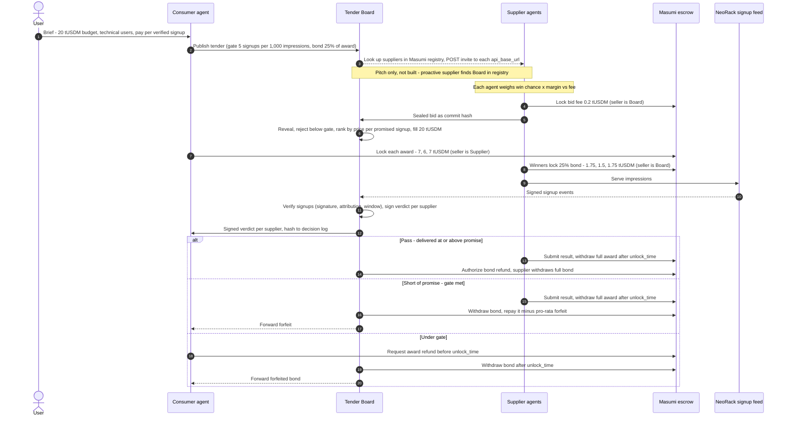

<aside>
🧭

Who pays whom, and what happens at each step. Copied from the sequence diagram on the Miro financial flow board, plus the worked example (frame 4) and settlement rules (frame 5). Units are **tUSDM on Cardano preprod**, a sandbox currency, not real money. Escrows run on Masumi. **Updated 8 Oct 2026 (Danila):** verification runs inside the Tender Board service, not as a separate Validator agent, so there is no Validator fee. 10 escrows; the 6 on the critical path are REAL, the 4 bid fees start SIMULATED and become REAL if time allows.

</aside>

## Areas

1. Agents 
    1. Consumer agents
        1. provides the facts and numbers
    2. Supplier agent
        1. supplier agent makes the creative, published the ad
            1. 
2. TenderBoard platform 
    1. signup
    2. phases - timed 
3. Financial rails - Masumi 
    1. formulas and automated proration 
4. Infra
    1. Vercel
    2. GH
5. Presentation - demo storyboard (live / recorded) 
    1. show website mockups or social media mockups with published ads and impressions
    

## What is a performance bond?

A **performance bond** is a deposit a winning supplier locks in escrow before it starts serving ads. It's 25% of the supplier's award, e.g. 1.75 tUSDM on a 7 tUSDM award. The supplier gets it back if it delivers what it promised. If it doesn't, it loses part or all of the bond, and that money goes to the Consumer.

**Why we use it:**

- **It makes promises costly to break.** Bids are ranked by price per *promised* signup, so without a bond a supplier could promise 12 signups per 1,000 impressions, win the cheapest slot, deliver 0 and lose nothing. The bond turns overpromising into a loss.
- **It compensates the advertiser.** Forfeited bond money goes to the Consumer, so a supplier that underdelivers partly pays for the advertiser's wasted time and budget.
- **The penalty is proportional.** A supplier that delivers 6 of its promised 8 signups loses a quarter of its bond: 1.5 × (8 − 6) ÷ 8 = 0.375. Missing the quality gate (fewer than 5 signups per 1,000) loses the whole bond.
- **It lets agents trust strangers.** Suppliers are agents found via a registry, with no history or contract between them and the advertiser. Money locked up front does the job that a contract or reputation would normally do.

<aside>
💡

The bond and the bid fee are different. The **bid fee** (0.2 tUSDM) is paid by every bidder, is never returned, and stays with the Board as an anti-spam fee. The **bond** is paid only by winners and comes back in full if they deliver.

</aside>

## Cast

| Actor | Role |
| --- | --- |
| **User NeoRack** | Human advertiser (NeoRack, a GPU neocloud). Gives the brief. |
| **NeoRack Consumer agent** | Advertiser's agent. Publishes the tender and pays the awards. |
| **Tender Board - middleman** | Our auction service. Collects bid fees, holds bonds, verifies delivery and signs the verdict per supplier. Cannot be same as customer - unfair |
| **Supplier agents** | Publishers (TechBlog, CodePodcast, DevNewsletter, GamingForum). They bid, serve impressions and post bonds. |
| **Masumi escrow** | On-chain escrow contract. Every payment below goes through it. |
| **NeoRack signup feed** | Source of signed outcome events (signup). |
| **Verifier (inside the Tender Board)** | Deterministic check in our service, not a separate agent: signature, attribution, time window. Issues a signed verdict per supplier. |

## Notes

Consumer and suppliers sign up for our platform - two registration flows. 

Once registered, classify your audience - suppliers. Collect metadata

board → service, not an agent

Consumer sends a request with audience as a parameter (jev model) 

## Step by step

### Phase 1: Brief and tender

1. **User → Consumer** 🤖 brief. Budget 20 tUSDM, audience technical users, pay per verified signup.
2. **Consumer**🤖 **→ Board:** publishes the tender. Quality gate is 5 signups per 1,000 impressions. Performance bond is 25% of the award.
3. **Board → Suppliers:** invites suppliers via the Masumi registry.
    
    <aside>
    🔎
    
    **Checked: possible, with a caveat.** The Masumi registry only does lookups. It has no messaging or invite feature. So "invite" means three steps. (1) The Board queries the Registry Service (`POST /registry-entry`) for supplier agents. (2) It reads each supplier's `api_base_url`. (3) It sends the tender to a small custom endpoint we add to our own supplier agents, e.g. `POST /tender-invite`. The standard MIP-003 `/start_job` doesn't fit here, because calling it would make the Board a paying buyer of a job. Source: masumi-registry-service.
    
    </aside>
    
4. **~~Proactive supplier → Board:** GamingForum finds the Board in the registry on its own and polls for tenders.~~
    - **~~Pitch only.** We mention this in the demo but don't build it. In the build, GamingForum gets invited like the other three.~~

### Phase 2: Bidding

1. Each supplier agent decides whether to bid by weighing **win chance × margin vs. the bid fee**. No money moves yet.
    - **Bid only if:** win chance × margin − bid fee (0.2 tUSDM) is above 0.
    - **Margin** = bid price − cost of serving the impressions. The agent operator sets the cost per 1,000 impressions (and optionally a minimum margin) in the agent's config.
    - **Win chance (proposal, not decided):** the agent compares its own price per promised signup *p* with a reference clearing price *R*. R is the highest winning price per signup in the last auction; for the first auction, the operator sets it. Win chance = clamp(2 − p ÷ R, 0, 1). That gives 1 when p ≤ R, falling to 0 at p = 2R. An LLM could do this estimate better, using the tender text and past results (open question 7).
    - *Example:* TechBlog's cost is 5 tUSDM per 1,000 impressions (assumed) and it bids 7, so its margin is 2. With p = 1.00 and R = 1.00, win chance = 1, so 1 × 2 − 0.2 = 1.8. That's above 0, so it bids.
2. 💸 **Supplier → Board, 0.2 tUSDM bid fee** (escrow, Board is the seller). Four suppliers pay, so 0.8 tUSDM in total.
3. **Supplier → Board:** sealed bid, posted as a commit hash.
    - ℹ️ What is a commit hash?
        
        A sealed bid in two steps, so that nobody can peek at a bid or change it later.
        
        - **Commit:** before the deadline, the supplier posts only `SHA-256(price, impressions, promised signups, salt)`. The salt is a random secret, so nobody can guess the bid by hashing likely prices.
        - **Reveal:** once bidding closes, the supplier sends the plain bid plus the salt. The Board recomputes the hash. If it doesn't match the commit, the bid is rejected.
        - **Why it matters:** no supplier can see the others' bids and undercut them. Nobody, the Board included, can change a bid after seeing the rest. The commit hashes are logged before the reveal, so anyone can audit the auction afterwards.
4. **Board:** reveals the bids, ranks them by price per promised signup and fills the 20 tUSDM budget. Ranking: DevNewsletter 0.39, CodePodcast 0.75, TechBlog 1.00 tUSDM. GamingForum is rejected because it promised 4 signups per 1,000, below the gate of 5.
    - **Eligible** only if promised signups per 1,000 impressions ≥ gate (5).
    - **Price per promised signup** = bid price ÷ (impressions ÷ 1,000 × promised signups per 1,000)
    - **Fill:** sort the eligible bids cheapest first. Accept each one while the running total of bid prices stays within the 20 tUSDM budget.
    - DevNewsletter 7 ÷ (1.5 × 12) = 0.39 → total 7 · CodePodcast 6 ÷ (1 × 8) = 0.75 → total 13 · TechBlog 7 ÷ (1 × 7) = 1.00 → total 20, budget full. GamingForum would be 3 ÷ (1 × 4) = 0.75, but it isn't eligible.

### Phase 3: Lock (critical path)

1. 💸 **Consumer → each winner, award locked in escrow** (Supplier is the seller): TechBlog 7, CodePodcast 6, DevNewsletter 7. Total 20 tUSDM. Award = the winning bid price.
2. 💸 **Each publisher → Board** 🤖**, 25% performance bond in escrow** (Board is the seller): TechBlog 1.75, CodePodcast 1.5, DevNewsletter 1.75. Total 5 tUSDM.
    - **Bond** = 25% × award:
    - TechBlog 0.25 × 7 = 1.75
    - CodePodcast 0.25 × 6 = 1.5
    - DevNewsletter 0.25 × 7 = 1.75.

### Phase 4: Delivery and verification

1. **Suppliers → NeoRack:** serve impressions.
2. **NeoRack feed → Board:** signed signup events. The Board's verifier counts verified signups per supplier.
3. **Board → Consumer:** signed verdict per supplier (Pass, Short of promise or Under gate). Its hash goes to the decision log.

**Notes**

NeoRack Consumer agent collects all statistics and facts across ad platforms - sends it to board after 2 weeks

### Phase 5: Settlement (one of three branches per supplier)

| Verdict | Award (Consumer → Supplier escrow) | Bond (Supplier → Board escrow) |
| --- | --- | --- |
| **Pass**: delivered at or above the promise | Supplier submits the result and withdraws the full award after unlock_time. | Board authorizes a refund, and the supplier withdraws the full bond. |
| **Short of promise**: gate met | Supplier submits the result and withdraws the full award after unlock_time. | Board withdraws the bond and repays it minus a pro-rata forfeit. Forfeit = bond × (promised − delivered) / promised. Escrows can't split, so the remainder goes back as a plain transfer. **Board → Consumer:** forwards the forfeit. |
| **Under gate** | Consumer reclaims the award. If no result was submitted, it does so after submit_result_time with no supplier signature needed. | Board withdraws the full bond after unlock_time. **Board → Consumer:** forwards the forfeited bond. |

## Worked example

<aside>
💵

All amounts are in **tUSDM**: test USDM, a USD-pegged stablecoin on Cardano preprod. Think of 1 tUSDM as $1, though it has no real value.

</aside>

| Supplier | Bid | Promised Sign Ups / delivered SignUps(per 1,000 impr.) | Result | Award (locked by Consumer) | Bond | Fee |
| --- | --- | --- | --- | --- | --- | --- |
| TechBlog | 1,000 impr. for 7 tUSDM | 7 / 8 | **Pass** | 7 tUSDM paid to TechBlog | 1.75 tUSDM returned | 0.2 tUSDM to Board |
| CodePodcast | 1,000 impr. for 6 tUSDM | 8 / 6 | **Short of promise** | 6 tUSDM paid to CodePodcast | 0.375 tUSDM forfeited, 1.125 tUSDM returned | 0.2 tUSDM to Board |
| DevNewsletter | 1,500 impr. for 7 tUSDM | 12 / 0 | **Under gate** | 7 tUSDM back to Consumer; DevNewsletter gets 0 | 1.75 tUSDM forfeited | 0.2 tUSDM to Board |
| GamingForum | 1,000 impr. for 3 tUSDM | 4 / not served | **Lost bid** (below gate) | None | None | 0.2 tUSDM to Board |

### How each number is calculated

All values are in tUSDM. Verdict rules: delivered ≥ promised is **Pass**. Delivered at least 5 (the gate) but below the promise is **Short of promise**. Delivered below 5 is **Under gate**.

| Step | TechBlog | CodePodcast | DevNewsletter | GamingForum |
| --- | --- | --- | --- | --- |
| Price per promised signup = bid ÷ (impressions ÷ 1,000 × promised per 1,000) | 7 ÷ (1 × 7) = 1.00 | 6 ÷ (1 × 8) = 0.75 | 7 ÷ (1.5 × 12) = 0.39 | 3 ÷ (1 × 4) = 0.75 |
| Eligible: promised ≥ 5 | 7 ≥ 5, yes | 8 ≥ 5, yes | 12 ≥ 5, yes | 4, **no**: rejected |
| Award = bid | 7 | 6 | 7 | none |
| Bond = 25% × award | 0.25 × 7 = 1.75 | 0.25 × 6 = 1.5 | 0.25 × 7 = 1.75 | none |
| Delivered vs. promised (per 1,000) | 8 vs. 7 → Pass | 6 vs. 8, gate met → Short of promise | 0 vs. 12 (0 from 1,500 impr.) → Under gate | not served |
| Award goes to | TechBlog: 7 | CodePodcast: 6 (full award) | Consumer: 7 back; DevNewsletter gets 0 | none |
| Forfeit = bond × (promised − delivered) ÷ promised; full bond if Under gate | 0 | 1.5 × (8 − 6) ÷ 8 = 0.375 | 1.75 (full bond) | none |
| Bond returned = bond − forfeit | 1.75 − 0 = 1.75 | 1.5 − 0.375 = 1.125 | 1.75 − 1.75 = 0 | none |
| Bid fee | 0.2 | 0.2 | 0.2 | 0.2 |
| **Supplier net** = award received − forfeit − fee | 7 − 0 − 0.2 = **+6.8** | 6 − 0.375 − 0.2 = **+5.425** | 0 − 1.75 − 0.2 = **−1.95** | 0 − 0 − 0.2 = **−0.2** |

### Net result

- **Consumer:** −20 escrowed, +7 refund, +2.125 forfeits (1.75 + 0.375) = **−10.875 tUSDM for 14 verified signups** (8 + 6). That's 10.875 ÷ 14 ≈ 0.78 tUSDM per signup.
- **Board:** +0.8 in bid fees = **+0.8**.

## Escrow count

| Escrow | Buyer → Seller | Count | Path |
| --- | --- | --- | --- |
| Bid fee | Supplier → Board | 4 | Background. SIMULATED first, REAL if time allows |
| Payment (award) | Consumer → Supplier | 3 | Critical. REAL |
| Performance bond | Supplier → Board | 3 | Critical. REAL |

That's 10 escrows, 6 of them on the critical path. The 6 critical-path escrows must be REAL (preprod tx + explorer link). The 4 bid fees run SIMULATED (labelled) and become REAL only if the critical path passes its dry run and time allows.

## Sequence diagram (source)

<aside>
⚠️

Open: is DevNewsletter refunded by **(a)** never submitting a result, so the Consumer reclaims after the deadline (recommended), or **(b)** submitting and having its agent authorize the refund? The diagram shows a refund request before unlock_time. Frame 5 describes option (a).

</aside>